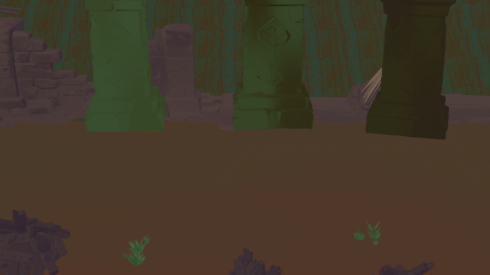

# Blender 3D 建模作品集

游戏资产方向 · 自学创作 · 累计 300h+ · 持续更新

> 所有 `.blend` / `.glb` 文件可在 GitHub 网页**直接点击 3D 预览**（无需下载）。
> 更多打包备份见 [Releases](https://github.com/mengge237/blender-works/releases)。

---

## 🗂️ 目录

- [01 角色模型](#01-角色模型)
- [02 道具与资产](#02-道具与资产)
- [03 场景](#03-场景)
- [04 特效练习](#04-特效练习)

---

## 01 角色模型

| 作品 | 文件 | 预览 |
|---|---|---|
| 骑士角色 | [`骑士.blend`](01_角色模型/骑士.blend) | 点击文件在网页查看 3D |
| 角色_1 | [`角色_1.blend`](01_角色模型/角色_1.blend) | 点击文件在网页查看 3D |
| 角色（FBX） | [`角色.fbx`](01_角色模型/角色.fbx) | FBX 格式，可导入引擎 |

## 02 道具与资产

| 作品 | 文件 | 预览 |
|---|---|---|
| 国际象棋套装 | [`国际象棋.blend`](02_道具与资产/国际象棋.blend) / [`国际象棋.fbx`](02_道具与资产/国际象棋.fbx) | 点击文件在网页查看 3D |
| 城堡 | [`城堡_1.blend`](02_道具与资产/城堡_1.blend) | 点击文件在网页查看 3D |
| 资产 GLB（可预览） | [`资产_1.glb`](02_道具与资产/资产_1.glb) | ⭐ 网页直接 3D 预览 |
| 资产 1~9 | [`assets_1.blend`](02_道具与资产/assets_1.blend) 等 9 个 | 点击文件在网页查看 3D |
| 室内家具套装 | [室内家具/](02_道具与资产/室内家具/)（桌椅/武器架/家具 12 件 FBX） | 导入引擎用 |

## 03 场景

| 作品 | 文件 | 渲染图 |
|---|---|---|
| 地牢场景 | [`地牢.png`](03_场景/地牢/地牢.png) |  |
| 场景1 | [`场景1.blend`](03_场景/场景1.blend) | 点击文件在网页查看 3D |

## 04 特效练习

| 作品 | 文件 | 说明 |
|---|---|---|
| 粒子系统 | [`粒子系统.blend`](04_特效练习/粒子系统.blend) | 粒子发射/运动模拟 |
| 云雾模拟 | [`云雾模拟.blend`](04_特效练习/云雾模拟.blend) | 体积云效果 |
| 损坏效果 | [`损坏效果.blend`](04_特效练习/损坏效果.blend) | 破碎/损伤材质 |
| 蛋糕建模 | [`蛋糕建模.blend`](04_特效练习/蛋糕建模.blend) | 曲面细分建模练习 |
| 液体模拟（Flip Fluid） | 缓存较大，见 Releases | 水球/流体动画 |

---

## 📎 与游戏项目联动

- 《异变棋局》（Unity 卡牌 Roguelike）：骑士、地牢、城堡等资产用于游戏场景
- 输出格式：`.blend` / `.fbx` / `.glb`，可直接导入 Unity / UE

## 🛠 工具链

Blender 4.x / 5.x · 粒子系统 · Flip Fluid 流体 · 体积云 · 材质与渲染

---
© 2026 游戏资产方向作品集 · 持续更新
